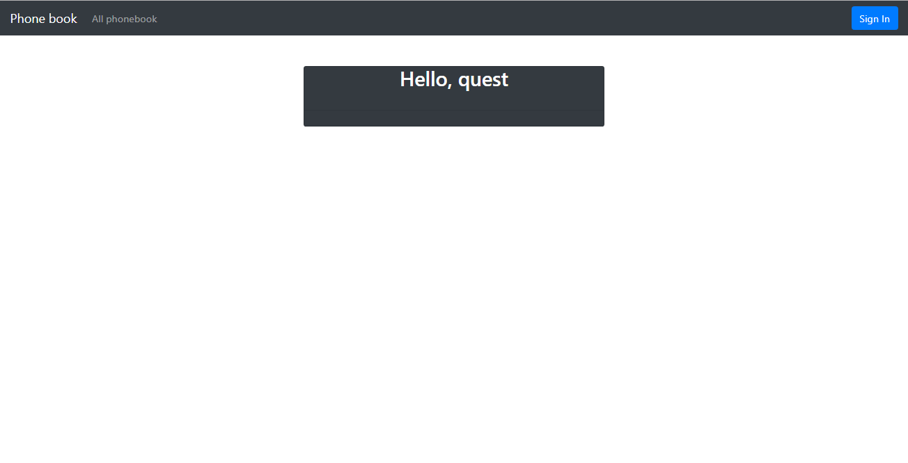

# Phone Book

Control systems versions: Maven;

Framework: Spring (Boot, MVC, Data, Security);

Database: PostgreSQL, JPA, Hibernate, flyway;

Json: Gson;

WEB: Freemarker, HTML, Bootstrap;

Test: Mockito, JUnit.
<hr>
Create DataBase PostgreSQL

```
drop database phonebook; create database phonebook;	
\c phonebook
CREATE EXTENSION pgcrypto;
```
<hr>
Create Test DataBase PostgreSQL

```
CREATE USER root WITH password 'root'; 
GRANT ALL ON DATABASE phonebooktest TO root;
drop database phonebooktest; create database phonebooktest;	
\c phonebooktest
CREATE EXTENSION pgcrypto;
```
<hr>
--spring.profiles.active=json
<hr>
API

```
GET /

   Response:
         list data source db
```

```
GET /?data=url

   Request:
      param data=url
      
   Response:
      list data source db
```

```
Post /

  Body: 
     

   Response:
      
      
```
<hr>




